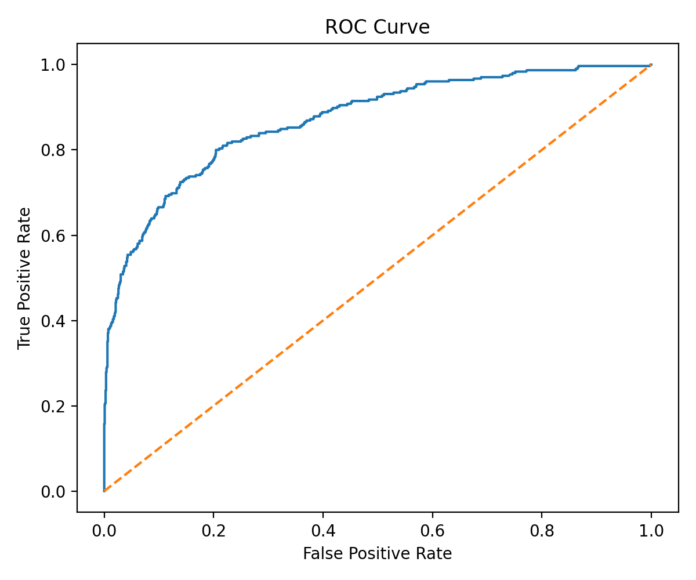
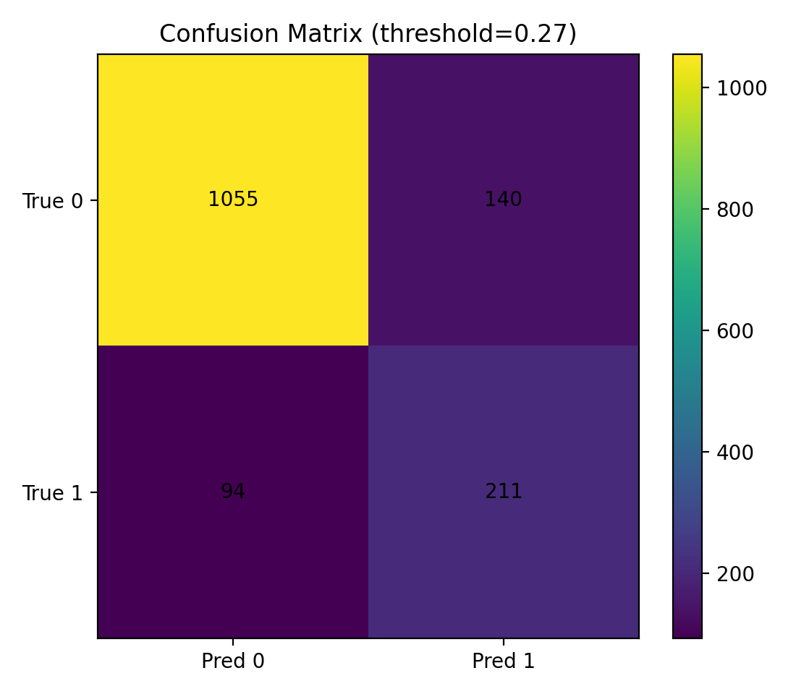
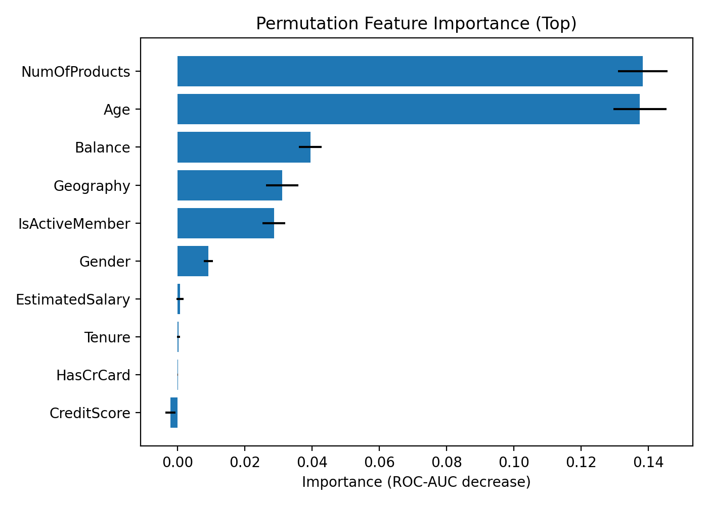

# Customer Churn Prediction (Bank Customers) — End-to-End ML Case Study

## Business context
Customer churn is costly because replacing lost customers typically requires more marketing and acquisition spend than retaining existing customers.  
This project builds a supervised machine learning model to **identify which customers are likely to churn** and to **explain the drivers behind churn**, enabling proactive retention strategies (targeted outreach, offers, product interventions).

> Note: This is a case study I did on Oct 2025 to practice building end-to-end ML pipelines. I now updated its libraries, code structure, documentation, reports, and make it publicly available.

## Dataset
- Source: Kaggle — “Churn for Bank Customers”
- Rows: 10,000 customers
- Target: `Exited` (1 = churn, 0 = retained)
- Features include: credit score, geography, gender, age, tenure, balance, products, activity, estimated salary.

> Note: This repo focuses on a clean ML pipeline and business-ready outputs. Metrics in the repo are generated by running the training script locally.

## Approach (pipeline)
1. **EDA**
   - Class balance (churn vs non-churn)
   - Churn rate by key segments (e.g., Geography, Gender)
   - Numeric distributions split by churn
   - Correlation heatmap (numeric-only)
2. **Preprocessing (leakage-safe)**
   - Drop non-predictive ID fields (`RowNumber`, `CustomerId`, `Surname`)
   - Impute missing values
   - One-hot encode categorical variables (`Geography`, `Gender`)
   - Scale numeric features (for linear models)
   - Implemented using `scikit-learn` `Pipeline` + `ColumnTransformer`
3. **Modeling**
   - Logistic Regression (interpretable baseline)
   - Random Forest (non-linear relationships, robust)
   - HistGradientBoosting (strong tabular baseline without extra dependencies)
   - Light hyperparameter tuning via `RandomizedSearchCV`
4. **Evaluation**
   - ROC-AUC, PR-AUC (for imbalance), Precision/Recall/F1, Confusion Matrix
   - Threshold selection on validation set (default: maximize F1)
   - Business-friendly metric: **Top-k recall** (e.g., recall among top 10% highest-risk customers)
5. **Interpretability**
   - Permutation feature importance for the selected best model
   - Odds ratios plot if Logistic Regression is selected

## Repository structure
```bash
bank-churn-prediction/
├─ data/raw/churn.csv
├─ models/ # saved pipeline + threshold + schema
├─ reports/ # metrics + figures
├─ src/ # reusable code modules
└─ scripts/ # train + score entrypoints
```

## How to run
### 1) Setup
```bash
python -m venv .venv
source .venv/bin/activate   # (Windows: .venv\Scripts\activate)
pip install -r requirements.txt
```
### 2) Put the dataset in place
Save churn.csv to:
```bash
data/raw/churn.csv
```

### 3) Train and generate outputs
```bash
python scripts/train.py --csv data/raw/churn.csv
```
Outputs:
- `models/best_model.joblib` (preprocessing + model pipeline)
- `models/best_threshold.json` 
- `reports/metrics.json` 
- `reports/figures/*.png` (EDA, ROC/PR curves, confusion matrix, feature importance)

### 4) Score new customers (batch)
Prepare a CSV with the same feature columns as training (excluding Exited) and run:
```bash
python scripts/score.py --in path/to/new_customers.csv --out reports/scored_customers.csv
```
The output includes:
- `churn_proba`: predicted probability of churn
- `churn_pred`: predicted churn label using the chosen threshold

## Insights & Recommendations

### ROC Curve



*ROC curve showing strong discrimination between churners and non-churners.*

### Confusion Matrix (Threshold = 0.27)



*Confusion matrix at the selected probability threshold, illustrating the precision–recall trade-off used for retention targeting.*


### Key Drivers of Churn



*Permutation feature importance highlighting key drivers of churn, including product count, age, balance, geography, and activity status.*

### Key Insights
- **Churn is imbalanced (~20%)**, making Precision–Recall and risk-based targeting more informative than accuracy.
- **Geographic differences are substantial**: customers in Germany show nearly **2× higher churn rate** than those in France or Spain, indicating strong regional effects.
- **Age and product usage matter**:
  - Older customers are significantly more likely to churn.
  - Customers with certain product counts (especially higher counts) show elevated churn risk.
- **Engagement is critical**: inactive customers have a clearly higher probability of churn compared to active members.

### Model Performance
- The selected Gradient Boosting model achieves strong ranking performance (ROC-AUC ≈ **0.87**, PR-AUC ≈ **0.73**).
- Using a tuned probability threshold (~**0.27**) balances precision and recall:
  - **Recall ≈ 69%**: most churners are successfully identified.
  - **Precision ≈ 60%**: a majority of flagged customers truly churn.
- **Targeting efficiency**:
  - Contacting the **top 10% highest-risk customers captures ~42% of all churners**.
  - Contacting the **top 5% captures ~24% of churners**.

### Recommendations
- Use churn scores for **risk-based targeting** instead of uniform retention campaigns.
- Prioritize outreach for:
  - Older, inactive customers
  - Customers with high-risk product profiles
  - High-churn regions (e.g., Germany)
- Integrate churn probabilities into CRM systems and rerun scoring periodically as customer behavior evolves.
